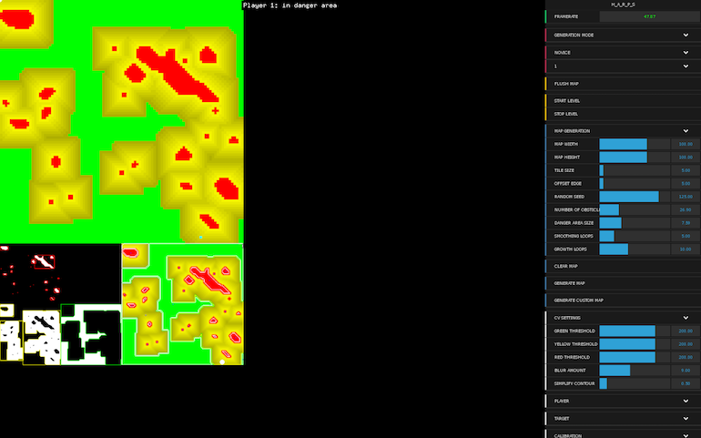
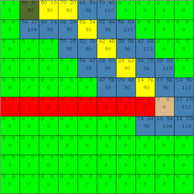

H.A.R.P.S
===

###Introduction

H.A.R.P.S (TBD) is path finding game, where users must navigate an object through toxic clouds to reach their goal.

The game uses an experimental localization system developed at Oxford University.

The project is funded and developed as part of the Being There project, which investigates robots, public space and empathy.

###Applications

This repository contains 4 applications.

* [H.A.R.P.S](H_A_R_P_S)

The Brain

* [H.A.R.P.S Simulator](H_A_R_P_S_simulator)

The development tool, that emulates the position of the Receivers and outputs OSC messages to the control application.

* [H.A.R.P.S iOS Controller]()

The controller that allows an operator to control the system whilst being mobile.

* [H.A.R.P.S Robot]()

The robot controller

###Shortcuts

* [Calibration]()
* [Operation]()
* [Tech Rider]()
* [Research]()
* [Game]()

Written in openFrameworks 0.9.0

###Dependancies
* [ofxJSON](https://github.com/jefftimesten/ofxJSON)
* [ofxQuadWarp](https://github.com/julapy/ofxQuadWarp)
* [ofxTween](https://github.com/arturoc/ofxTween)
* [ofxDatGui](https://github.com/braitsch/ofxDatGui)
* [ofxCv](https://github.com/kylemcdonald/ofxCv)
* [ofxOsc]()
* [ofxNetwork]()
* [ofxOpenCv]()

