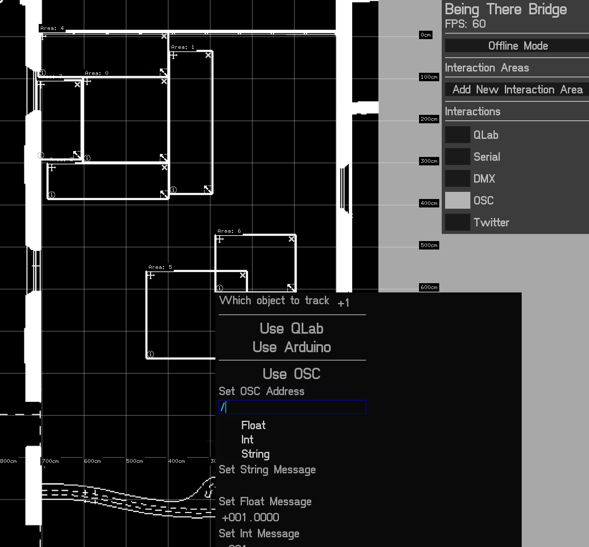

Map Generation
===

###How H.A.R.P.S Map Generator Works?

####Old
In the original map generator, users would have to manually define areas of interaction by dragging and dropping boxes on to a map then assign actions to the areas. 

If a marker or receiver entered the area the attributed action would happen.

The boxes allowed multiple actions to occur at the same time but were extremely time consuming to layout and rapid prototyping was not an option.

Image of Original Map Maker

####New
The new system uses similar principles from the original system. In that if a marker/receiver enters the area an action will happen. However,the areas only have three predefined actions.

* Ok
* Danger
* Deadly

These are then intepreted by the robot.

####Ok, but what are the processes that make the map?

The map is based on a Grid of Tiles.
Each tile has a set of attributes.
Such as size, position and neighbours.

But the two most important attributes are: 

* Walkability
* Toxic Value

What do we mean when we say 'Walkability'.
Quite simply is the tile walkable, can the marker move through it or not. You can imagine it as a switch, a true or false value.

Take this grid of 5x5 tiles

* 0 = Not Walkable
* 1 = Walkable

| 0 | 1 | 1 | 1 |
|---|---|---|---|
| 0 | 0 | 1 | 0 |
| 0 | 1 | 1 | 1 |
| 0 | 1 | 1 | 0 |
| 0 | 0 | 0 | 0 |

The 1's are the walkable path through the grid.

Toxic Value is the value of danger attributed to that tile.

Toxic Value allows users to understand that they are approaching areas of danger.

A non walkable tile has a toxic value of 0 and a walkable tile has a toxic value of 0.

But a walkable tile can have a toxic value up to 20, the lower the number the closer it is to the non walkable tile.

For instance, back to our grid

* N = Not Walkable
* wValue = Walkable and Toxic Value
 
| w0 | w0 | w0 | w0 | w0 |
|---|---|---|---|---|
| w0 | w0 | w0 | w0 | w0 |
| w0 | w1 | w1 | w1 | w0 |
| w0 | w1 | N | w1 | w0 |
| w0 | w1 | w1 | w1 | w0 |
| w0 | w0 | w0 | w0 | w0 |
| w0 | w0 | w0 | w0 | w0 |

####So...
Each time a new map is generated a grid of tiles is created. All the tiles are set to be walkable. 

Then users define how many obsticles there are on the grid so how many N Tiles exist. This process is randomised, so x and y coordinates are chosen on the fly. However, we seed the random number generator, meaning we can replicate the exact coordinates of the non walkable tiles.

The generator then grows the original Tiles by X, using celluar automata.

For instance:

This,

| w0 | w0 | w0 | w0 | w0 |
|---|---|---|---|---|
| w0 | w0 | w0 | w0 | w0 |
| w0 | w0 | w0 | w0 | w0 |
| w0 | w0 | N | w0 | w0 |
| w0 | w0 | w0 | w0 | w0 |
| w0 | w0 | w0 | w0 | w0 |
| w0 | w0 | w0 | w0 | w0 |

could turn into this ...

| w0 | w0 | w0 | w0 | w0 |
|---|---|---|---|---|
| w0 | w0 | w0 | w0 | w0 |
| w0 | w0 | N | N | w0 |
| w0 | N | N | N | w0 |
| w0 | N | N | w0 | w0 |
| w0 | w0 | w0 | w0 | w0 |
| w0 | w0 | w0 | w0 | w0 |

This obsticle is then smoothed, and the user can define whether to have a danger area and how big to make that area.

Basic example

| w0 | w0 | w0 | w0 | w0 |
|---|---|---|---|---|
| w0 | w1 | w1 | w1 | w1 |
| w1 | w1 | N | N | w1 |
| w1 | N | N | N | w1 |
| w1 | N | N | w1 | w1 |
| w1 | w1 | w1 | w1 | w0 |
| w0 | w0 | w0 | w0 | w0 |

This grid is then fed in to a openCV contour finder which looks for three distinct colors - Red, Yellow and Green. Then generates contours/Polylines around the shapes. 

###Seeded Generation
Resources 

###Custom Generation
Map Editor
